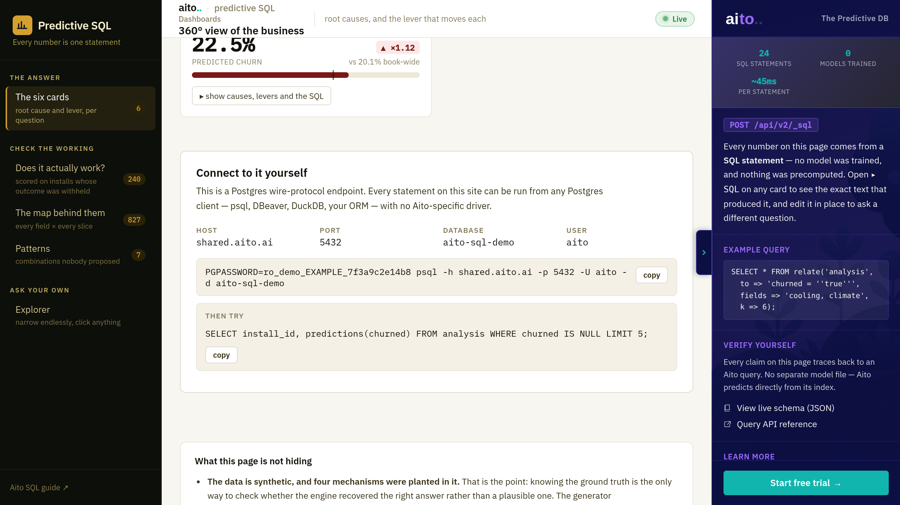
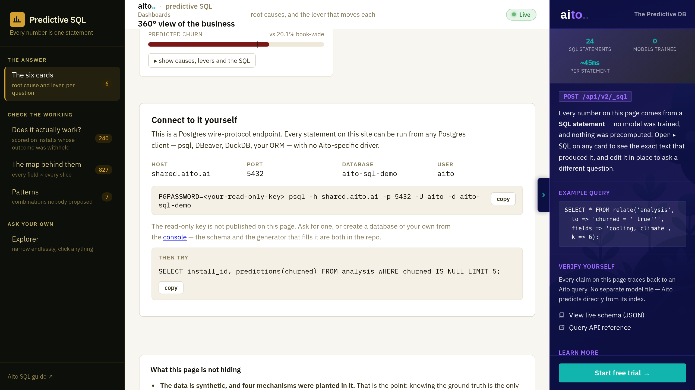

# The Connect box: publish a key, or don't

One decision, two variants, both already supported by the code. Nothing needs
changing to pick either — the box reads `AITO_SQL_READONLY_KEY` from the
deployment's App Settings and renders accordingly. **Set it or don't.**

The screenshots here are taken from a real local run; the key shown in variant A
is a made-up illustrative string (`ro_demo_EXAMPLE_…`), never the real one.

## Variant A — key published



A reader copies one line and is querying the demo in about ten seconds. This is
the version that makes the demo's central claim checkable by the person reading
it, which is the whole reason the box exists — *"it's just Postgres"* is worth
very little if the reader cannot try it.

What it costs: a working credential sits on a public page. It is read-only and
the engine enforces that (`permission denied: this connection authenticated
with a read-only API key; 'CREATE' requires a read-write key` — measured, not
assumed). But it is on a shared instance, and a reader can run expensive queries
against it; a key on a public page is also a key that gets scraped, pasted into
other people's notes, and is awkward to rotate once it is in circulation.

## Variant B — placeholder, bring your own key



Host, port, database and user are all still shown, so the shape of the thing is
clear and the `psql` line is correct apart from the credential. The reader is
pointed at the console to make a database of their own — the schema and the
generator that fills it are both in this repo, so they can reproduce the demo
rather than borrow it.

What it costs: the reader cannot actually run anything. For the audience this
box was added for — an engineer who wants to check that it really is SQL over
the Postgres wire — "ask us for a key" is the point at which most of them stop.

## Where it is decided

```
# aito-demo-server/.env.local AND Azure App Settings
AITO_SQL_READONLY_KEY=<the READ-ONLY key>     # set -> variant A
                                              # unset -> variant B
```

No redeploy of this repo is needed to switch; it is read per request
(`/api/connect`, `src/app.py`).

## The recommendation, for what it is worth

**Variant A, with a key minted for this purpose and rotated on a schedule** —
not the key used for anything else. The demo's argument is that a prospect can
verify it themselves, and B removes the verifying. If A is not acceptable, B is
genuinely fine and the box still teaches the shape; it just stops being a
demonstration and becomes a description.

This is a narrative/credential decision, so it is Antti's, not a lane's.
